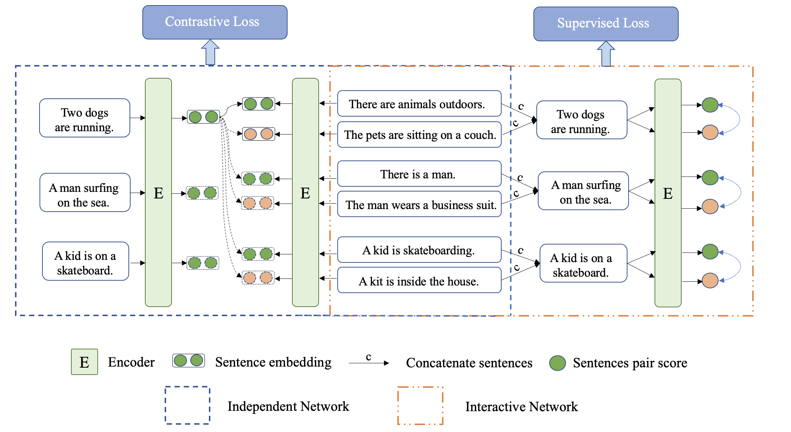

## InterCSE: Interactive Contrastive Learning of Sentence Embeddings

This repository contains the code and pre-trained models for our paper [Supervised Sentence Representation with Interactive Loss Decay](https://openreview.net/forum?id=pUaN67UPJf).

**************************** **Updates** ****************************
* 6/14: We commited [our paper](https://openreview.net/forum?id=pUaN67UPJf) to EMNLP 2023. Review it!


## Quick Links

  - [Overview](#overview)
  - [Model List](#model-list)
  - [Use InterCSE with Huggingface](#use-intercse-with-huggingface)
  - [Train InterCSE](#train-intercse)
    - [Requirements](#requirements)
    - [Evaluation](#evaluation)
    - [Training](#training)
  - [Bugs or Questions?](#bugs-or-questions)

## Overview

We propose a interactive contrastive learning framework for Supervised Sentence Representation.
We followed SimCSE using annotated pairs from NLI datasets into contrastive learning by using `entailment` pairs as positives and `contradiction` pairs as hard negatives. The following figure is an illustration of our models.




## Model List

Our released models are listed as following. You can import these models by using the `intercse` package or using [HuggingFace's Transformers](https://github.com/huggingface/transformers). 
|              Model              | Avg. STS |
|:-------------------------------|:--------:|
|  [2hip3ng/intercse-bert-base-uncased](https://huggingface.co/2hip3ng/intercse-bert-base-uncased) |   82.11 |
| [2hip3ng/intercse-bert-large-uncased](https://huggingface.co/2hip3ng/intercse-bert-large-uncased) |   82.88  |

<!-- 
Note that the results are slightly better than what we have reported in the current version of the paper after adopting a new set of hyperparameters (for hyperparamters, see the [training](#training) section). -->


## Use InterCSE with Huggingface

Besides using our provided sentence embedding tool, you can also easily import our models with HuggingFace's `transformers`:
```python
import torch
from scipy.spatial.distance import cosine
from transformers import AutoModel, AutoTokenizer

# Import our models. The package will take care of downloading the models automatically
tokenizer = AutoTokenizer.from_pretrained("2hip3ng/intercse-bert-base-uncased")
model = AutoModel.from_pretrained("2hip3ng/intercse-bert-base-uncased")

# Tokenize input texts
texts = [
    "There's a kid on a skateboard.",
    "A kid is skateboarding.",
    "A kid is inside the house."
]
inputs = tokenizer(texts, padding=True, truncation=True, return_tensors="pt")

# Get the embeddings
with torch.no_grad():
    embeddings = model(**inputs, output_hidden_states=True, return_dict=True).pooler_output

# Calculate cosine similarities
# Cosine similarities are in [-1, 1]. Higher means more similar
cosine_sim_0_1 = 1 - cosine(embeddings[0], embeddings[1])
cosine_sim_0_2 = 1 - cosine(embeddings[0], embeddings[2])

print("Cosine similarity between \"%s\" and \"%s\" is: %.3f" % (texts[0], texts[1], cosine_sim_0_1))
print("Cosine similarity between \"%s\" and \"%s\" is: %.3f" % (texts[0], texts[2], cosine_sim_0_2))
```

If you encounter any problem when directly loading the models by HuggingFace's API, you can also download the models manually from the above table and use `model = AutoModel.from_pretrained({PATH TO THE DOWNLOAD MODEL})`.

## Train InterCSE

In the following section, we describe how to train a InterCSE model by using our code.

### Requirements

First, install PyTorch by following the instructions from [the official website](https://pytorch.org). To faithfully reproduce our results, please use the correct `1.7.1` version corresponding to your platforms/CUDA versions. PyTorch version higher than `1.7.1` should also work. For example, if you use Linux and **CUDA11** ([how to check CUDA version](https://varhowto.com/check-cuda-version/)), install PyTorch by the following command,

```bash
pip install torch==1.7.1+cu110 -f https://download.pytorch.org/whl/torch_stable.html
```

If you instead use **CUDA** `<11` or **CPU**, install PyTorch by the following command,

```bash
pip install torch==1.7.1
```


Then run the following script to install the remaining dependencies,

```bash
pip install -r requirements.txt
```

### Evaluation
Our evaluation code for sentence embeddings is based on a modified version of [SentEval](https://github.com/facebookresearch/SentEval). It evaluates sentence embeddings on semantic textual similarity (STS) tasks and downstream transfer tasks. For STS tasks, our evaluation takes the "all" setting, and report Spearman's correlation.

Before evaluation, please download the evaluation datasets by running
```bash
cd SentEval/data/downstream/
bash download_dataset.sh
```

Then come back to the root directory, you can evaluate any `transformers`-based pre-trained models using our evaluation code. For example,
```bash
python evaluation.py \
    --model_name_or_path princeton-nlp/sup-simcse-bert-base-uncased \
    --pooler cls \
    --task_set sts \
    --mode test
```
which is expected to output the results in a tabular format:
```
------ test ------
+-------+-------+-------+-------+-------+--------------+-----------------+-------+
| STS12 | STS13 | STS14 | STS15 | STS16 | STSBenchmark | SICKRelatedness |  Avg. |
+-------+-------+-------+-------+-------+--------------+-----------------+-------+
| 75.83 | 85.05 | 80.82 | 86.00 | 81.07 |    84.86     |      81.16      | 82.11 |
+-------+-------+-------+-------+-------+--------------+-----------------+-------+
```

Arguments for the evaluation script are as follows,

* `--model_name_or_path`: The name or path of a `transformers`-based pre-trained checkpoint. You can directly use the models in the above table, e.g., `princeton-nlp/sup-simcse-bert-base-uncased`.
* `--pooler`: Pooling method. Now we support
    * `cls` (default): Use the representation of `[CLS]` token. A linear+activation layer is applied after the representation (it's in the standard BERT implementation). If you use **supervised SimCSE**, you should use this option.
    * `cls_before_pooler`: Use the representation of `[CLS]` token without the extra linear+activation. If you use **unsupervised SimCSE**, you should take this option.
    * `avg`: Average embeddings of the last layer. If you use checkpoints of SBERT/SRoBERTa ([paper](https://arxiv.org/abs/1908.10084)), you should use this option.
    * `avg_top2`: Average embeddings of the last two layers.
    * `avg_first_last`: Average embeddings of the first and last layers. If you use vanilla BERT or RoBERTa, this works the best.
* `--mode`: Evaluation mode
    * `test` (default): The default test mode. To faithfully reproduce our results, you should use this option.
    * `dev`: Report the development set results. Note that in STS tasks, only `STS-B` and `SICK-R` have development sets, so we only report their numbers. It also takes a fast mode for transfer tasks, so the running time is much shorter than the `test` mode (though numbers are slightly lower).
    * `fasttest`: It is the same as `test`, but with a fast mode so the running time is much shorter, but the reported numbers may be lower (only for transfer tasks).
* `--task_set`: What set of tasks to evaluate on (if set, it will override `--tasks`)
    * `sts` (default): Evaluate on STS tasks, including `STS 12~16`, `STS-B` and `SICK-R`. This is the most commonly-used set of tasks to evaluate the quality of sentence embeddings.
    * `transfer`: Evaluate on transfer tasks.
    * `full`: Evaluate on both STS and transfer tasks.
    * `na`: Manually set tasks by `--tasks`.
* `--tasks`: Specify which dataset(s) to evaluate on. Will be overridden if `--task_set` is not `na`. See the code for a full list of tasks.

### Training

**Data**

We use the SNLI and MNLI datasets. You can run `data/download_wiki.sh` and `data/download_nli.sh` to download the two datasets.

**Training scripts**

We provide example training scripts. In `run_sup_example.sh` we give a **multiple-GPU** example for the supervised version on Bert-base. 
In `run_sup_example_large.sh` we give a **multiple-GPU** example for the supervised version on Bert-large. 
Both scripts call `train.py` for training. We explain the arguments in following:
* `--train_file`: Training file path. We support "txt" files (one line for one sentence) and "csv" files (2-column: pair data with no hard negative; 3-column: pair data with one corresponding hard negative instance). You can use our provided Wikipedia or NLI data, or you can use your own data with the same format.
* `--model_name_or_path`: Pre-trained checkpoints to start with. For now we support BERT-based models (`bert-base-uncased`, `bert-large-uncased`, etc.) and RoBERTa-based models (`RoBERTa-base`, `RoBERTa-large`, etc.).
* `--temp`: Temperature for the contrastive loss.
* `--pooler_type`: Pooling method. It's the same as the `--pooler_type` in the [evaluation part](#evaluation).
* `--alpha_list`: interactive loss decay value. 
* `--mlp_only_train`: We have found that for unsupervised SimCSE, it works better to train the model with MLP layer but test the model without it. You should use this argument when training unsupervised SimCSE models.
* `--hard_negative_weight`: If using hard negatives (i.e., there are 3 columns in the training file), this is the logarithm of the weight. For example, if the weight is 1, then this argument should be set as 0 (default value).
* `--do_mlm`: Whether to use the MLM auxiliary objective. If True:
  * `--mlm_weight`: Weight for the MLM objective.
  * `--mlm_probability`: Masking rate for the MLM objective.

All the other arguments are standard Huggingface's `transformers` training arguments. Some of the often-used arguments are: `--output_dir`, `--learning_rate`, `--per_device_train_batch_size`. In our example scripts, we also set to evaluate the model on the STS-B development set (need to download the dataset following the [evaluation](#evaluation) section) and save the best checkpoint.

For results in the paper, we use Nvidia 3090 GPUs with CUDA 11. Using different types of devices or different versions of CUDA/other softwares may lead to slightly different performance.

**Hyperparameters**

We use the following hyperparamters for training InterCSE:

|               | BERT-base | BERT-large | 
|:--------------|:-----------:|:--------------:|
| Batch size    | 512         | 256            |
| Learning rate | 1e-4 | 3e-5 |
| Temp          | 0.04 | 0.05 | 
| Epochs        | 4    | 4    |
| $\alpha$ list | [10, 1, 0.1, 0.01, 0.001]   |  [1, 0.1, 0.01, 0.001, 0.0001]    |


**Convert models**

Our saved checkpoints are slightly different from Huggingface's pre-trained checkpoints. Run `python simcse_to_huggingface.py --path {PATH_TO_CHECKPOINT_FOLDER}` to convert it. After that, you can evaluate it by our [evaluation](#evaluation) code or directly use it [out of the box](#use-our-models-out-of-the-box).


## Bugs or questions?

If you have any questions related to the code or the paper, feel free to email Tianyu (`zhipengwang1121@gmail.com`) a. If you encounter any problems when using the code, or want to report a bug, you can open an issue. Please try to specify the problem with details so we can help you better and quicker!


